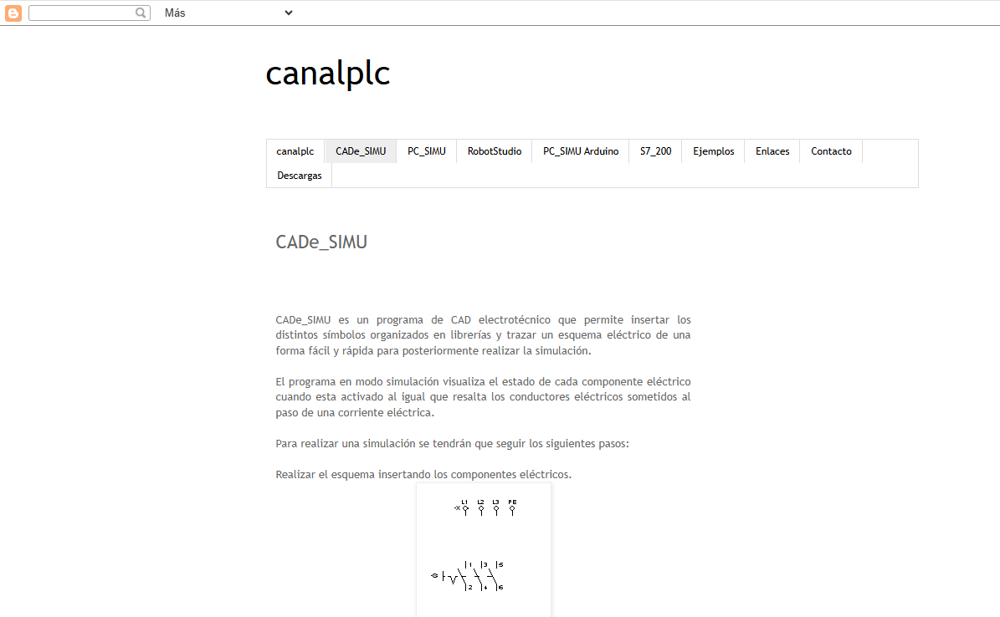
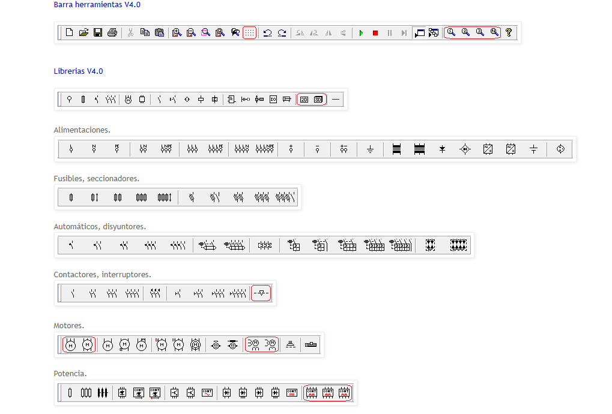
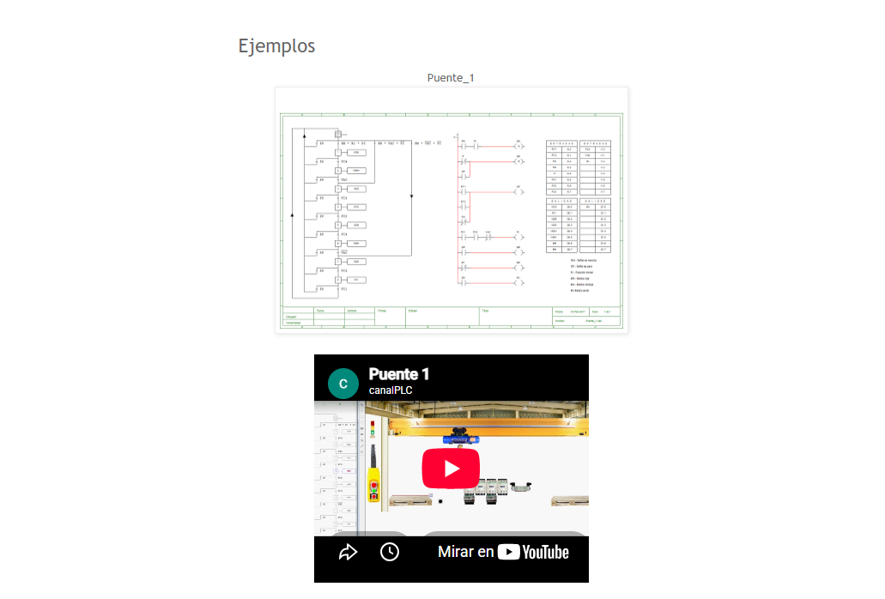
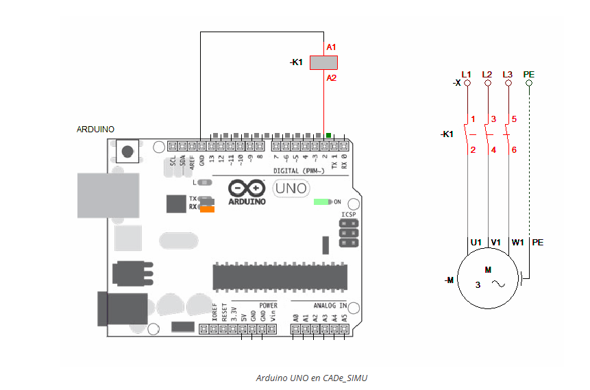

# Parte 01 - Descarga e Instalacion

  

Descarga e instalacion de CADe SIMU y PC SIMU, paso a paso.

## 1- Ver el video

Video de esta parte: https://youtu.be/jxl94Go8yDo

Playlist completa del curso: https://www.youtube.com/playlist?list=PL12Fo7Tlkoigvi0rdW3g-1iNB54jVpZp-

## 2- Descargas

| Programa | Enlace de descarga |
| --- | --- |
| CADe SIMU | https://masterplc.com/cade-simu/descargar/ |
| PC SIMU | https://masterplc.com/programas/pc-simu/ |

## Informacion adicional

Ademas del video, hay una pagina web muy completa sobre CADe SIMU: **canalplc**. Es una de las mejores fuentes gratuitas que existen en español.

Pagina principal: https://canalplc.blogspot.com/p/cadesimu.html

  

### Que vas a encontrar ahi

**Manual de uso.** Explica como armar un esquema, por que los componentes siempre se deben unir con cable y nunca de forma directa, los colores del cableado, y como el programa detecta cortocircuitos y fallas a masa durante la simulacion.

**Todas las librerias de simbolos.** Imagenes de cada libreria del programa: alimentaciones, fusibles, seccionadores, automaticos, contactores, motores, potencia, contactos, accionamientos, detectores, bobinas, señalizaciones, reles electronicos, logica, ladder, grafcet, entradas y salidas, electroneumatica y simbolos 2D / 3D.

**Manuales en PDF** de las versiones 1, 3 y 4 del programa.

  

### Ejemplos de circuitos reales

Circuitos ya armados, cada uno con su video de simulacion:

https://canalplc.blogspot.com/p/ejemplos.html

Entre ellos hay **puente grua**, ascensor, semaforo, persiana automatica, cuadro estrella-triangulo, electroneumatica, mecatronica, compactadora de chatarra, secuenciales y un cuadro electrico de vivienda con domotica.

  

### CADe SIMU con Arduino

Esto es de lo mas interesante que tiene la pagina. CADe SIMU 4 se puede comunicar con un Arduino real, o sea que el esquema que dibujas en el computador puede controlar hardware fisico.

- Conectar CADe SIMU 4 a un Arduino UNO: https://www.profetolocka.com.ar/2021/01/28/cade_simu-4-conectando-a-un-arduino-uno/
- Arranque y parada de motor con Arduino: https://www.profetolocka.com.ar/2021/02/08/cade_simu-4-arranque-y-parada-de-motor-con-arduino/
- Control de motores paso a paso: https://www.profetolocka.com.ar/2021/04/15/cade_simu-4-control-de-motores-paso-a-paso/

Ese ultimo te va a servir mucho cuando llegues a la **Parte 14** y la **Parte 15** del curso, que son de motor paso a paso.

  

### Otras secciones del mismo blog

| Seccion | Enlace |
| --- | --- |
| PC SIMU | https://canalplc.blogspot.com/p/pcsimu.html |
| PC SIMU con Arduino | https://canalplc.blogspot.com/p/pcsimu_20.html |
| PLC S7-200 | https://canalplc.blogspot.com/p/s7200.html |
| Descargas | https://canalplc.blogspot.com/p/blog-page_14.html |

> Nota: el blog lleva varios años publicado y algunos enlaces externos ya no abren. Si uno no carga, busca el tema directo en YouTube.
## Que encontraras aqui

En esta parte no hay archivos .cad para descargar. El objetivo es dejar CADe SIMU y PC SIMU instalados y funcionando en tu computador.

Desde la Parte 02 en adelante si vas a encontrar los archivos de cada clase para que los abras, los modifiques y practiques.

## Como hacerlo

**Paso 1.** Descarga CADe SIMU desde el enlace de arriba

**Paso 2.** Descomprime el archivo

**Paso 3.** Ejecuta el programa y verifica que abra sin errores

**Paso 4.** Repite el proceso con PC SIMU

**Paso 5.** Sigue el video si se te presenta algun problema en la instalacion

[<- Volver al inicio](../README.md)
