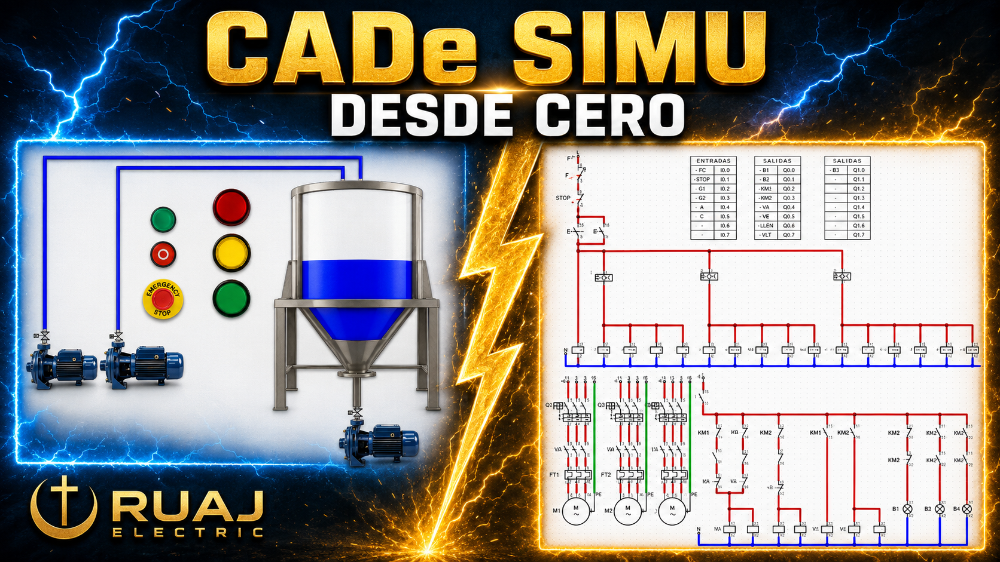

# Parte 01 - Descarga e Instalacion

  

Descarga e instalacion de CADe SIMU y PC SIMU, paso a paso.

## Ver el video

Video de esta parte: https://youtu.be/jxl94Go8yDo

Playlist completa del curso: https://www.youtube.com/playlist?list=PL12Fo7Tlkoigvi0rdW3g-1iNB54jVpZp-

## Descargas

| Programa | Enlace de descarga |
| --- | --- |
| CADe SIMU | https://masterplc.com/cade-simu/descargar/ |
| PC SIMU | https://masterplc.com/programas/pc-simu/ |

## Informacion adicional

Pagina de apoyo con informacion y modelado de circuitos:

https://canalplc.blogspot.com/p/cadesimu.html

## Que encontraras aqui

En esta parte no hay archivos .cad para descargar. El objetivo es dejar CADe SIMU y PC SIMU instalados y funcionando en tu computador.

Desde la Parte 02 en adelante si vas a encontrar los archivos de cada clase para que los abras, los modifiques y practiques.

## Como hacerlo

**Paso 1.** Descarga CADe SIMU desde el enlace de arriba

**Paso 2.** Descomprime el archivo

**Paso 3.** Ejecuta el programa y verifica que abra sin errores

**Paso 4.** Repite el proceso con PC SIMU

**Paso 5.** Sigue el video si se te presenta algun problema en la instalacion

[<- Volver al inicio](../README.md)
