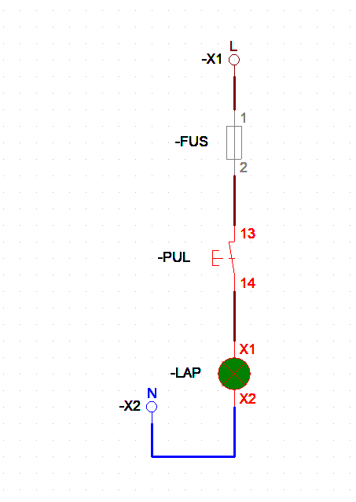

# Parte 03 - Alimentaciones

  

De donde viene la tension de tu circuito, y como se representa en CADe SIMU.

## Ver el video

Video de esta parte: https://youtu.be/rcxgFrjaRxg

Playlist completa del curso: https://www.youtube.com/playlist?list=PL12Fo7Tlkoigvi0rdW3g-1iNB54jVpZp-

## Antes de dibujar: escoge tu alimentacion

Todo esquema empieza aqui. Si escoges mal la alimentacion, el resto del
circuito puede quedar perfecto y aun asi no funcionar.

| Que vas a simular | Alimentacion que escoges | Bornes |
| --- | --- | --- |
| Circuito de mando, iluminacion, tomas | Monofasica | L · N · PE |
| Ducha, aire, horno, motor de 1-2 HP | Dos fases | L1 · L2 · N · PE |
| Motor trifasico, bomba, compresor | Trifasica con PE | L1 · L2 · L3 · N · PE |
| Mando separado de la potencia | Transformador | 1-2 / 3-4 |
| Sensores, PLC, LEDs, electronica | Fuente DC | +V · -V · PE |

Ahora veamos cada uno.

---

## 1. Monofasico

### Que es

Una fase y un neutro. En Colombia son 120 V entre fase y neutro.

Es lo que tienes en la casa: la luz, el tomacorriente, el ventilador.
En industria es lo que alimenta el circuito de mando.

### En CADe SIMU

Escoges la alimentacion monofasica. Te aparecen tres bornes:

| Borne | Que es | Que conectas |
| --- | --- | --- |
| L | Fase | Va al fusible o al ITM del circuito |
| N | Neutro | Va al retorno: bobina, lampara, bornera de salida |
| PE | Tierra de proteccion | Va a la carcasa del equipo |

### Colores RETIE para este sistema

| Conductor | Color |
| --- | --- |
| Fase | Negro |
| Neutro | Blanco |
| Tierra de proteccion | Verde o desnudo |

### 🔧 Practica 1 - Tu primer circuito monofasico

  

Este es el circuito mas simple que existe, y ya tiene TODO lo esencial:
alimentacion, proteccion, mando y carga. Si entiendes este, entiendes
el 80% de la logica cableada. 💪

**Que lleva:**

| Componente | Etiqueta | Que hace |
| --- | --- | --- |
| Bornera de entrada | -X1 | Por aqui entra la fase L al tablero |
| Fusible | -FUS | Protege el circuito |
| Pulsador | -PUL | Da la orden |
| Lampara | -LAP | La carga, lo que se ve funcionar |
| Bornera de salida | -X2 | Por aqui sale el neutro N |

**Armalo asi:**

**Paso 1.** Pon la alimentacion monofasica y saca la fase L a la bornera -X1

**Paso 2.** De -X1 baja al fusible -FUS (bornes 1 y 2)

**Paso 3.** Del fusible al pulsador -PUL (bornes 13 y 14)

**Paso 4.** Del pulsador a la lampara -LAP (bornes X1 y X2)

**Paso 5.** De la lampara devuelvete a la bornera -X2, que es tu neutro

**Paso 6.** Dale simular y oprime el pulsador ⚡

Si la lampara enciende, lo lograste. 🎉

**Fijate en esto antes de seguir:**

Mira el recorrido de la corriente. Entra por L, pasa por el fusible, pasa
por el pulsador, llega a la lampara, y se devuelve por N. Ese camino cerrado
es TODO. Si en cualquier punto se abre, no pasa nada.

Activa **Visualizar numero de cable** (Archivo → Configuracion, como vimos
en la Parte 02) y mira como el numero cambia cada vez que la corriente
atraviesa un componente. 👀

**Ahora rompelo a proposito:** 🔨

Desconecta el cable que va de la lampara a la bornera -X2 y simula otra vez.
El pulsador funciona, el fusible esta bueno, todo se ve bien... pero la
lampara no enciende.

Ese es el error mas comun del principiante: dejar el circuito abierto. Y es
tambien el error mas comun en campo. Un neutro flojo en la bornera y el
equipo simplemente no arranca, sin que nada se vea dañado.

Vuelvelo a conectar y sigue. ✅
---

## 2. Dos fases (lo que en campo llamamos "bifasico")

### Que es

Aqui hay que tener cuidado, porque se confunden dos sistemas distintos:

**Sistema 120/240 V.** Sale de un transformador con toma central. Entre las
dos lineas hay 240 V, y de cada linea al neutro hay 120 V. El RETIE lo
clasifica como sistema MONOFASICO de dos fases.

**Dos fases de un trifasico 208/120 V.** Aqui entre fases hay 208 V, no 240.

O sea que "bifasico" es palabra de campo, no de norma, y la tension depende
de que sistema tengas atras. Antes de asumir 240 V, mide.

### En CADe SIMU

No hay un componente que se llame "bifasico". Lo armas de dos formas:

**Opcion A - desde la trifasica.** Pones la alimentacion trifasica y usas
solo L1 y L2. Los demas bornes los dejas sin conectar.

**Opcion B - con transformador de toma central.** Usas el transformador de
3 terminales. La toma del medio es tu neutro, y los extremos son las dos
lineas.

La opcion B es la que representa de verdad un sistema 120/240.

### Colores RETIE para 120/240 V

| Conductor | Color |
| --- | --- |
| Fase 1 | Negro |
| Fase 2 | Rojo |
| Neutro | Blanco |
| Tierra de proteccion | Verde o desnudo |

### Practica

Arma una ducha electrica: dos lineas, un ITM bipolar, y la resistencia
entre las dos fases.

---

## 3. Trifasico

### Que es

Tres fases desfasadas 120 grados entre si, mas neutro.

- Fase a neutro: 120 V
- Fase a fase: 208 V en el sistema 208/120, que es el mas comun en industria
- Otros niveles que vas a encontrar: 440 V, 480 V

Es lo que mueve motores, bombas, compresores y tableros industriales.

### En CADe SIMU

Escoges la alimentacion trifasica CON PE. Hay una version sin PE, pero
para un tablero real siempre usa la que trae tierra.

| Borne | Que es | Que conectas |
| --- | --- | --- |
| L1 L2 L3 | Las tres fases | Van al ITM o guardamotor tripolar |
| N | Neutro | Solo si tienes cargas monofasicas o mando |
| PE | Tierra de proteccion | Va a la carcasa del motor |

Fijate en algo: **el motor trifasico no necesita neutro.** Trabaja entre
fases. El neutro lo pones cuando vas a sacar 120 V para el circuito de
mando o para una lampara de señalizacion.

### RST o L1-L2-L3

Es lo mismo, solo cambia el nombre:

| Nomenclatura | Donde la vas a ver |
| --- | --- |
| L1 · L2 · L3 | Norma IEC, planos, CADe SIMU |
| R · S · T | Campo, tableros viejos, jerga colombiana |
| U · V · W | Bornes del motor |

Cuando en CADe SIMU conectas L1-L2-L3 al motor, esos bornes del motor se
llaman U1-V1-W1. Ahi ves las dos nomenclaturas en el mismo esquema.

### Colores RETIE para trifasico estrella 208/120 V

| Conductor | Color |
| --- | --- |
| Fase 1 | Amarillo |
| Fase 2 | Azul |
| Fase 3 | Rojo |
| Neutro | Blanco |
| Tierra de proteccion | Verde o desnudo |
| Tierra aislada | Verde con amarillo |

### Practica

Vuelve al circuito de la Parte 02. Ese arranque directo ya usa alimentacion
trifasica con PE. Mirale ahora los bornes con otros ojos.

---

## 4. Transformador

### Ojo con esto: en CADe SIMU es un simbolo, no un transformador

Esto es lo primero que hay que entender. Al transformador de CADe SIMU
**no le puedes ingresar valores**. No tiene campo de tension de entrada,
ni de salida, ni de potencia.

O sea que el programa no calcula nada. No reduce tension, no simula la
relacion de espiras, no te avisa si lo sobrecargas.

Esta ahi para que tu esquema quede bien dibujado: para representar que en
ese punto del tablero hay un transformador y que de ahi para abajo el
circuito de mando esta separado de la potencia.

**Que si hace:** deja pasar la señal para que la simulacion siga corriendo
del primario al secundario.

**Que no hace:** cambiar la tension, calcular corriente, o avisarte de un
error de dimensionamiento.

Si lo que necesitas es calcular el transformador de tu tablero, eso no se
hace en CADe SIMU. Se hace con las hojas de datos del fabricante.

### Los dos que trae el programa

| Componente | Terminales | Cuando usarlo |
| --- | --- | --- |
| Transformador 2 terminales | 1-2 primario / 3-4 secundario | El normal, reduccion simple |
| Transformador 3 terminales | 1-2-3 / 4-5-6 | Cuando tu esquema necesita toma central |

### Como se conecta

**Paso 1.** Arrastra el transformador al esquema

**Paso 2.** Conecta el primario (bornes 1-2) a dos fases de la potencia

**Paso 3.** Del secundario (bornes 3-4) sale tu circuito de mando

**Paso 4.** De ahi para abajo van los pulsadores, contactos y bobinas

Lo que cambia en tu esquema no es la tension, es la **lectura**: cualquiera
que vea el plano entiende de una que el mando esta separado de la potencia.

### En el plano si escribes los valores

Como el programa no los guarda, los pones tu con la herramienta de texto.
Al lado del simbolo escribes algo como:

    TR1  220/110 V  100 VA

Asi el que lea el plano sabe que transformador hay que comprar. En un plano
real esa informacion nunca falta.

### Practica

Toma el arranque directo de la Parte 02 y metele un transformador entre la
potencia y el mando. Simula y fijate: el circuito sigue funcionando igual.
Eso te confirma que el transformador aqui es representacion, no calculo.
---

## 5. Fuente DC

### Que es

Convierte corriente alterna en corriente continua. Es lo que alimenta
sensores, PLCs, LEDs y toda la electronica del tablero.

### En CADe SIMU

| Borne | Que es | Que conectas |
| --- | --- | --- |
| L · L · L | Entrada en alterna | Vienen de las fases |
| +V | Positivo de salida | Al positivo de tus componentes DC |
| -V | Negativo de salida | Al negativo, para cerrar el circuito |
| PE | Tierra | A la carcasa |

### El error que todo el mundo comete

**Todo componente DC tiene que quedar conectado entre +V y -V.**

Si solo conectas la entrada AC, o solo el PE, la simulacion corre, no da
ningun error, pero los LEDs no encienden. Y uno se queda mirando la pantalla
sin entender que paso.

Si algo DC no funciona, lo primero que revisas es si tiene sus dos polos.

---

## Dos reglas de CADe SIMU que aplican a todo

### Regla 1 - Los bornes de alimentacion ya estan unidos por dentro

Si pones varios bornes L o varios N en el mismo esquema, el programa los
considera el mismo potencial y los conecta internamente. No tienes que
dibujar un cable entre ellos.

Esto es exactamente lo de la Parte 02: mismo potencial, mismo numero.

### Regla 2 - El blanco y el verde nunca son fase

Regla del RETIE, no del programa. Pero acostumbrate desde el simulador,
porque en campo esto salva vidas.

- Neutro: blanco, o marcado con blanco en todas las partes visibles
- Tierra de proteccion: verde, o marcada con franja verde
- El verde-amarillo es para tierra AISLADA, que es otra cosa distinta

> Cuidado con el material importado. El codigo europeo IEC 60446 usa marron
> para fase y azul para neutro. Si conectas con logica RETIE un equipo
> europeo, puedes tomar un azul de neutro por una fase.

## Material de apoyo externo

Estos documentos no son mios y no estan alojados aqui. Son de acceso
publico y solo los enlazo, dando credito a sus autores.

**RETIE** - Reglamento Tecnico de Instalaciones Electricas
Norma de obligatorio cumplimiento en Colombia. Consultalo en el sitio del
Ministerio de Minas y Energia y verifica que sea la version vigente.

**Normalizacion y simbologia electrica** - Govern de les Illes Balears
https://sarreplec.caib.es/pluginfile.php/14797/mod_resource/content/9/IEB08/Normalizacion_simbologia_electrica.pdf

**CADe SIMU en canalplc** - manual y librerias de simbolos
https://canalplc.blogspot.com/p/cadesimu.html

---

> "Porque nosotros no hemos recibido el espiritu del mundo,
> sino el Espiritu que proviene de Dios."
> — 1 Corintios 2:12

[<- Volver al inicio](../README.md)
