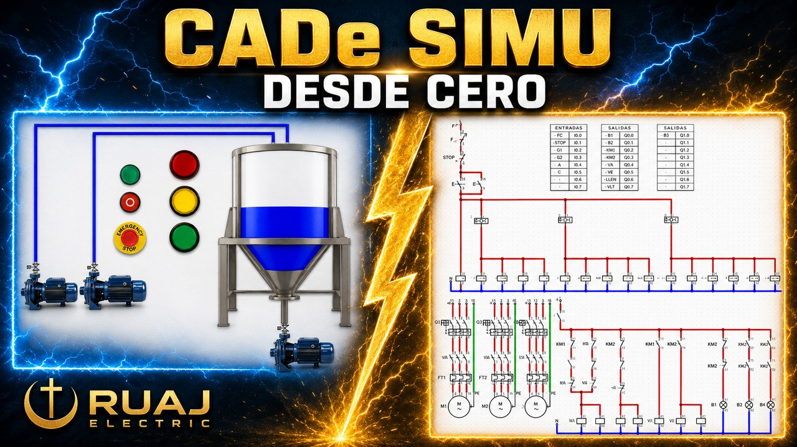

# CURSO CADe SIMU - RUAJ ELECTRIC

Material de apoyo 100% gratuito para aprender simulacion de circuitos electricos desde cero.

Cada carpeta corresponde a una parte del curso en video. Descarga los archivos, abrelos, modificalos y practica.

---

## Como descargar

**Todo el curso de una vez:**

1. Boton verde **Code** (arriba a la derecha) -> **Download ZIP**
2. Descomprime el archivo
3. Abre los archivos `.cad` con CADe SIMU

**Solo una parte:** entra a la carpeta que necesites y descarga el archivo.

> Todavia no tienes CADe SIMU? Es gratuito. En la **Parte 01** te muestro como descargarlo e instalarlo paso a paso.

---

## Contenido del curso

| Carpeta | Tema |
|---------|------|
| Parte-01-Descarga-e-Instalacion | Descarga e instalacion de CADe SIMU y PC SIMU |
| Parte-02-Numeracion-Equipotencial-y-Borneras | Numeracion equipotencial y borneras |
| Parte-03-Alimentaciones | Monofasico, bifasico y trifasico |
| Parte-04-Fusibles | Todo sobre los fusibles |
| Parte-05-ITM-vs-Guardamotor | ITM vs guardamotor |
| Parte-06-Contactor-vs-Guardamotor | Contactor vs guardamotor |
| Parte-07-Arranque-Triangulo | Arranque en triangulo y pico de corriente |
| Parte-08-Arranque-Estrella | Arranque en estrella y grafica de corriente |
| Parte-09-Arranque-Estrella-Triangulo | Arranque estrella-triangulo |
| Parte-10-Motor-Monofasico | Motor monofasico y condensador |
| Parte-11-Motor-Dahlander | Motor Dahlander, dos velocidades |
| Parte-12-Rotor-Bobinado-vs-Jaula-de-Ardilla | Rotor bobinado vs jaula de ardilla |
| Parte-13-Motor-Corriente-Continua | Motor de corriente continua |
| Parte-14-Motor-Paso-a-Paso | Motor paso a paso |
| Parte-15-Motor-Paso-a-Paso-Simulado | Motor paso a paso simulado en vivo |
| Parte-16-Freno-Electromecanico | Freno electromecanico |

---

## Ver el curso en video

Playlist completa: https://www.youtube.com/playlist?list=PL12Fo7Tlkoigvi0rdW3g-1iNB54jVpZp-

Tambien te puede servir el Curso Completo de Logica Cableada: https://www.youtube.com/playlist?list=PL12Fo7Tlkoig8wqMjAtumefqP0pb7R954

---

## Para quien es esto?

- Tecnicos electricistas que quieren simular antes de conectar en fisico
- Estudiantes del SENA, universidades e institutos tecnicos
- Quien confunda un ITM con un guardamotor
- Cualquiera que quiera aprender a leer un plano electrico industrial

---

## Licencia

Uso libre para aprender, practicar y ensenar. No necesitas pedir permiso ni dar credito.

---

## Sigueme

- TikTok: https://www.tiktok.com/@ruaj.electric
- Musica libre de derechos: https://github.com/ruajelectric-dotcom/musica-libre-ruaj

---

> "Porque no hemos recibido el espiritu del mundo, sino el Espiritu que proviene de Dios, para que conozcamos lo que Dios nos ha dado gratuitamente." - 1 Corintios 2:12
